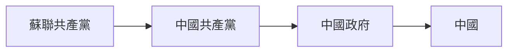

先有蘇聯共產黨，才有中國共產黨，再有中國政府，最終才有中國。由於蘇聯將他們的黨支部建立在上海取名中國共產黨，因此獨立建國之後將這土地取名中國，我們因此獲得一個中國人的稱呼。國家是一個族群的集體想象和集體意識，并不是一個跟花草樹木一樣真實的存在，是統治者塑造一個集體想象奴役我們的工具。

```mermaid
graph LR
A[蘇聯共產黨] -->B[中國共產黨] -->C[中國政府] -->D[中國]

```
中國人生活在恐懼和謊言下。

