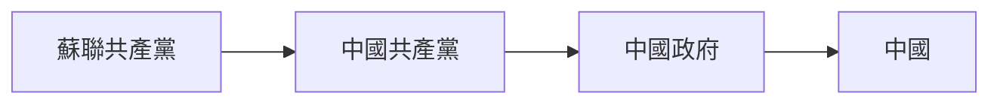

共產黨說我們是中國人，我們就成了中國人。先有蘇聯共產黨，才有中國共產黨，再有中國政府，最終才有中國。由於蘇聯將他們的黨支部建立在上海取名中國共產黨，因此獨立建國之後將這土地取名中國，我們因此獲得一個中國人的稱呼。國家是一個族群的集體想象和集體意識，并不是一個跟花草樹木一樣真實的存在，是統治者奴役我們的工具。

**中國人生活在恐懼和謊言下。**

**中共不允許台灣人修改國號，允許台灣人在家裏自己說中華民國，不允許台灣人到處説中華民國。共產黨允許中國普通人關起門來評論共產黨領導人，不允許任何人公開負面評論中共領導人。**

**爲什麽中國人**

雇傭者是去中心化，沒有核心。過去軟件工程師開發某個產品的一個功能，可能會跟團隊中的其他人共用一個文件。分佈式開發出現之後，我們將一個項目分成多個子項目，也就是將一個功能拆分成一個項目，最終整合成一個完整的軟件，不會共用文件。雇傭者是一個產品的某個功能，獨立出來成爲一個項目。

